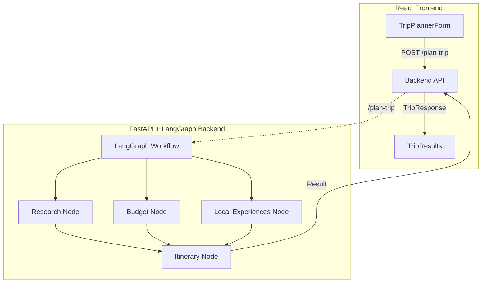

# AI Trip Planner – Architecture & Specification

## Overview

The AI Trip Planner is a full-stack application for intelligent, fast, and customizable trip planning. It leverages modern LLMs, parallel workflow orchestration, and observability tooling.

---

## Architecture Diagram



---

## 1. Frontend

- **Framework:** React + TypeScript
- **UI:** Material-UI (MUI)
- **Key Components:**
  - `TripPlannerForm`: Collects user input (destination, duration, budget, interests, travel style)
  - `TripResults`: Displays the generated itinerary
- **API Interaction:**  
  - Sends a POST request to `/plan-trip` on the backend with user input
  - Handles loading, error, and result states

---

## 2. Backend

- **Framework:** FastAPI (Python)
- **Orchestration:** LangGraph (parallel workflow engine)
- **LLM Integration:** OpenAI, Groq, or other LLMs via LangChain/LiteLLM
- **Observability:** Arize, OpenInference, OpenTelemetry
- **Key Nodes (Functions):**
  - `research_node`: Gathers destination/event research
  - `budget_node`: Analyzes costs
  - `local_experiences_node`: Finds authentic local recommendations
  - `itinerary_node`: Synthesizes all data into a day-by-day plan
- **Parallel Execution:**  
  - Research, budget, and local experiences nodes run in parallel for speed
  - All feed into the itinerary node, which produces the final output

---

## 3. Infrastructure

- **Dockerized:** Both frontend and backend have Dockerfiles
- **Orchestration:** Docker Compose for local development
- **Environment Variables:** Managed via `.env` files for API keys and configuration

---

## 4. API

- **POST `/plan-trip`**  
  - **Request:**  
    ```json
    {
      "destination": "Tokyo, Japan",
      "duration": "7 days",
      "budget": "$2000",
      "interests": "food, culture, temples",
      "travel_style": "cultural"
    }
    ```
  - **Response:**  
    ```json
    {
      "result": "# 7-Day Tokyo Cultural Experience\n\n## Day 1: Arrival and Asakusa District..."
    }
    ```
- **GET `/health`**  
  - Health check endpoint

---

## 5. Observability

- **Tracing:** All LLM/tool calls are instrumented for traceability (Arize, OpenInference)
- **Prompt Templates:** Each node uses versioned, tracked prompt templates for reproducibility

---

# Adapting for Event Planning

To create an event planning application, you can reuse this architecture with the following changes:

## 1. Rename and Refactor Nodes

- **Research Node:**  
  - Research event venues, dates, and logistics instead of travel destinations.
- **Budget Node:**  
  - Analyze event costs (venue, catering, entertainment, etc.).
- **Local Experiences Node:**  
  - Curate local vendors, entertainment options, or guest experiences.
- **Itinerary Node:**  
  - Build a detailed event schedule (sessions, breaks, activities).

## 2. Update Prompt Templates

- Change prompt templates to focus on event planning (e.g., "Find top venues for a tech conference in San Francisco").
- Track new versions for event-specific tasks.

## 3. Update Frontend Forms

- Change form fields to collect event-specific data (event type, date, location, number of guests, preferences).
- Update `TripPlannerForm` and `TripResults` to reflect event planning terminology.

## 4. API and Data Models

- Update request/response models to use event-specific fields.
- Example:
  ```json
  {
    "event_type": "wedding",
    "location": "San Francisco, CA",
    "date": "2025-09-15",
    "budget": "$20,000",
    "guest_count": 100,
    "preferences": "outdoor, live music, vegan options"
  }
  ```

## 5. Workflow Graph

- The parallel node structure remains effective for event planning:
  ```
  START → [Venue Research, Budget, Local Vendors] → Event Schedule → END
         (parallel execution)
  ```

## 6. Observability

- Keep tracing and prompt versioning for debugging and improvement.

---

# Example: Event Planning Node Mapping

| Trip Planner Node      | Event Planner Node         | Description                                 |
|-----------------------|---------------------------|---------------------------------------------|
| research_node         | venue_research_node       | Find venues, check availability, reviews    |
| budget_node           | event_budget_node         | Estimate costs for venue, food, extras      |
| local_experiences_node| vendor_recommendation_node| Suggest caterers, entertainment, decorators |
| itinerary_node        | event_schedule_node       | Build event timeline/schedule               |

---

# Tech Stack Summary

- **Frontend:** React, TypeScript, Material-UI
- **Backend:** FastAPI, LangGraph, LangChain, LLMs (OpenAI/Groq), Observability (Arize, OpenTelemetry)
- **Infrastructure:** Docker, Docker Compose, .env for secrets

---

# Extensibility Notes

- The modular, node-based workflow makes it easy to swap in new logic for different domains (e.g., event planning, conference scheduling, etc.).
- Prompt templates and API models are the main points of customization.
- Observability and tracing are built-in for all LLM/tool calls. 