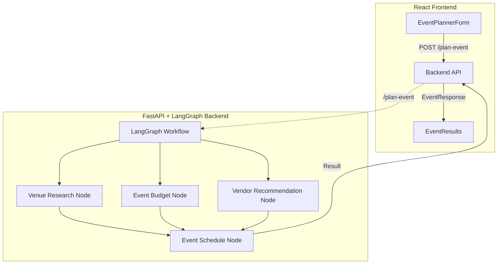

# AI Event Planner – Architecture & Specification

## Overview

The AI Event Planner is a full-stack application for intelligent, fast, and customizable event planning. It leverages modern LLMs, parallel workflow orchestration, and observability tooling.

---

## Architecture Diagram



---

## 1. Frontend

- **Framework:** React + TypeScript
- **UI:** Material-UI (MUI)
- **Key Components:**
  - `EventPlannerForm`: Collects user input (event type, date, location, budget, guest count, preferences)
  - `EventResults`: Displays the generated event schedule
- **API Interaction:**  
  - Sends a POST request to `/plan-event` on the backend with user input
  - Handles loading, error, and result states

---

## 2. Backend

- **Framework:** FastAPI (Python)
- **Orchestration:** LangGraph (parallel workflow engine)
- **LLM Integration:** OpenAI, Groq, or other LLMs via LangChain/LiteLLM
- **Observability:** Arize, OpenInference, OpenTelemetry
- **Key Nodes (Functions):**
  - `venue_research_node`: Gathers venue options, availability, and reviews
  - `event_budget_node`: Analyzes costs (venue, catering, entertainment, etc.)
  - `vendor_recommendation_node`: Finds local vendors, entertainment, and guest experiences
  - `event_schedule_node`: Synthesizes all data into a detailed event schedule
- **Parallel Execution:**  
  - Venue research, budget, and vendor recommendation nodes run in parallel for speed
  - All feed into the event schedule node, which produces the final output

---

## 3. Infrastructure

- **Dockerized:** Both frontend and backend have Dockerfiles
- **Orchestration:** Docker Compose for local development
- **Environment Variables:** Managed via `.env` files for API keys and configuration

---

## 4. API

- **POST `/plan-event`**  
  - **Request:**  
    ```json
    {
      "event_type": "wedding",
      "location": "San Francisco, CA",
      "date": "2025-09-15",
      "budget": "$20,000",
      "guest_count": 100,
      "preferences": "outdoor, live music, vegan options"
    }
    ```
  - **Response:**  
    ```json
    {
      "result": "# Wedding Event Schedule\n\n## 3:00pm: Ceremony at Golden Gate Park..."
    }
    ```
- **GET `/health`**  
  - Health check endpoint

---

## 5. Observability

- **Tracing:** All LLM/tool calls are instrumented for traceability (Arize, OpenInference)
- **Prompt Templates:** Each node uses versioned, tracked prompt templates for reproducibility

---

## Workflow Graph

The parallel node structure enables efficient event planning:
```
START → [Venue Research, Budget, Vendor Recommendations] → Event Schedule → END
       (parallel execution)
```

---

# Event Planning Node Mapping

| Event Planner Node         | Description                                 |
|---------------------------|---------------------------------------------|
| venue_research_node       | Find venues, check availability, reviews    |
| event_budget_node         | Estimate costs for venue, food, extras      |
| vendor_recommendation_node| Suggest caterers, entertainment, decorators |
| event_schedule_node       | Build event timeline/schedule               |

---

# Tech Stack Summary

- **Frontend:** React, TypeScript, Material-UI
- **Backend:** FastAPI, LangGraph, LangChain, LLMs (OpenAI/Groq), Observability (Arize, OpenTelemetry)
- **Infrastructure:** Docker, Docker Compose, .env for secrets

---

# Extensibility Notes

- The modular, node-based workflow makes it easy to swap in new logic for different event types (e.g., weddings, conferences, parties, etc.).
- Prompt templates and API models are the main points of customization.
- Observability and tracing are built-in for all LLM/tool calls. 